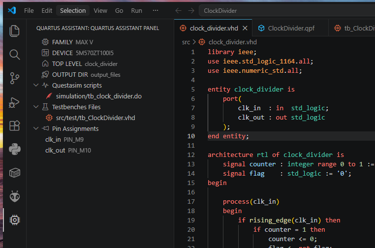
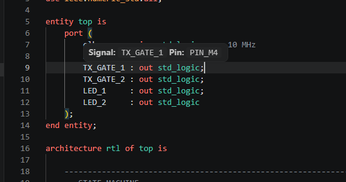
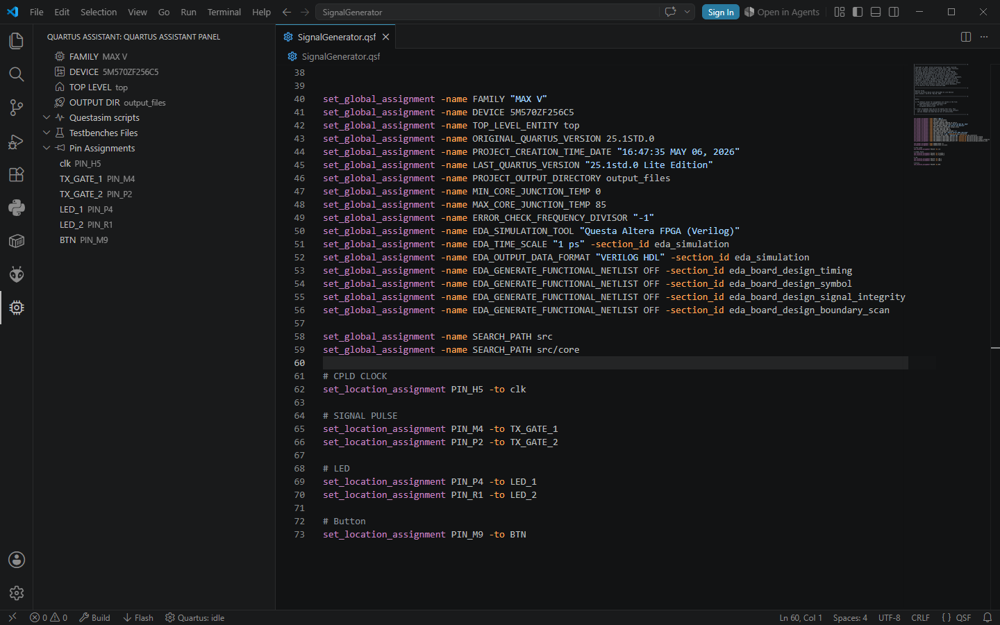
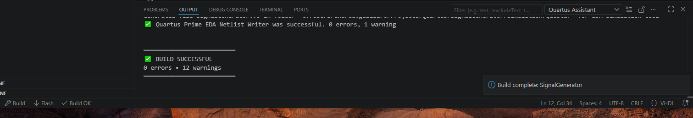
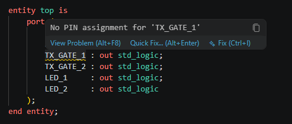

# 🚀 Quartus Assistant

Complete Quartus + VHDL workflow integration for Visual Studio Code.



Quartus Assistant brings FPGA development directly into VSCode with:

- ⚡ Quartus build integration
- 🧪 QuestaSim workflow support
- 🔎 VHDL entity/package navigation
- 📌 FPGA pin diagnostics
- 🔗 QSF integration
- 🤖 Automatic `.do` generation
- 🎨 Semantic highlighting
- 📚 Workspace-wide indexing


---

# ✨ Features


## 🔎 VHDL Navigation

Navigate through your VHDL project with full `Ctrl+Click` support.

Supported navigation:

- entities
- packages
- package symbols
- FPGA pin assignments

Example:

```vhdl
entity work.uart_tx
````

or

```vhdl
use work.pulse_pkg.all;
```

Jump directly to the declaration.

---

## 📌 FPGA Pin Integration

Quartus Assistant understands your `.qsf` constraints and links them directly to VHDL signals.

### 🖱️ Pin Hover Information

Hover a top-level signal to instantly see the assigned FPGA pin.



---

## 🔗 QSF Navigation

`Ctrl+Click` on a VHDL signal to jump directly to the corresponding pin assignment inside the `.qsf` file.

Integrated FPGA-aware navigation between:

* VHDL
* Quartus constraints
* package symbols

---

## 🌲 Quartus Project Explorer

Dedicated FPGA project TreeView integrated inside VSCode.

Features:

* Top-level entity detection
* Pin assignment explorer
* QuestaSim scripts explorer
* Testbench management




---

## ⚡ Quartus Workflow Integration

Run your FPGA workflow directly from VSCode.

Supported actions:

* Build
* Flash
* Simulation launch
* Questa `.do` generation

Integrated status bar controls:


### 🏗️ Integrated Quartus Build and Flash Output

Quartus Assistant provides integrated build execution and live tool output directly inside VSCode.



---

# ⚠️ Diagnostics

Quartus Assistant validates top-level FPGA pin assignments directly inside the editor.

Warnings are generated automatically when:

* a top-level signal has no assigned FPGA pin
* constraints are missing from the `.qsf`

Example warning:




---

# 🎨 Semantic Highlighting

The extension provides semantic highlighting for:

* entities
* packages
* imported package symbols
* FPGA pin-aware signals

Highlighting only appears when declarations actually exist inside the indexed workspace.

---

# 📚 Automatic Workspace Indexing

Workspace-wide indexing for:

* `.vhd`
* `.vhdl`
* VHDL entities
* packages
* package symbols

The index updates automatically when:

* files are created
* files are deleted
* files are modified

---

# 🛠️ Supported Toolchain

* Intel Quartus Prime
* QuestaSim / ModelSim
* VHDL

---

# 🤔 Why Quartus Assistant?

FPGA workflows inside VSCode are usually fragmented across multiple tools.

Quartus Assistant unifies:

* editing
* navigation
* simulation
* constraints
* diagnostics
* build tools

inside a single lightweight VSCode workflow.

---

# 📦 Installation

Install directly from the Visual Studio Code Marketplace.

---

# 🗺️ Roadmap

Planned features:

* references provider
* semantic tokens
* waveform integration
* pin planner integration

---

# 📄 License

MIT License.
